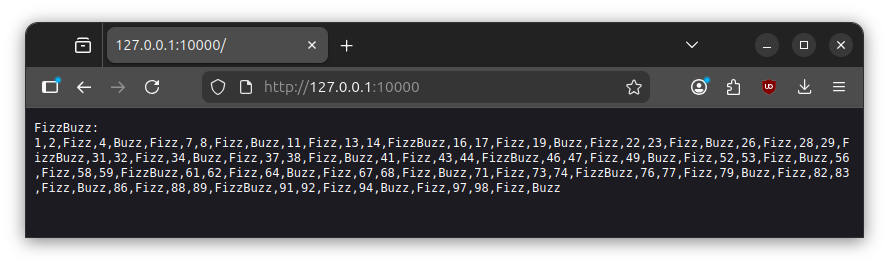
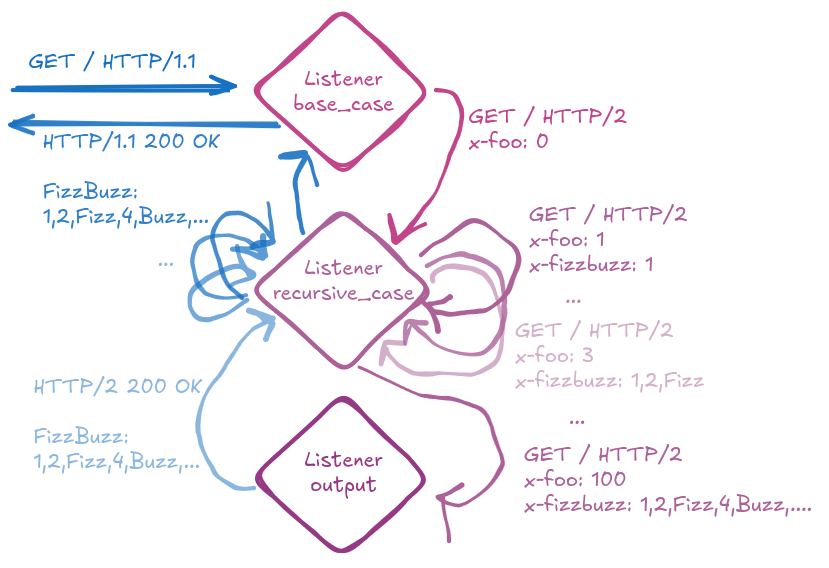
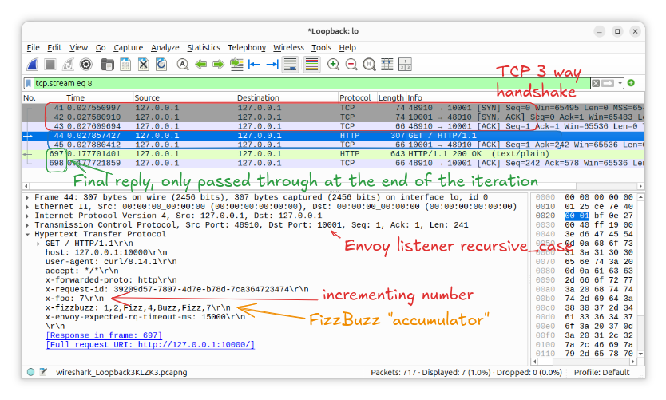
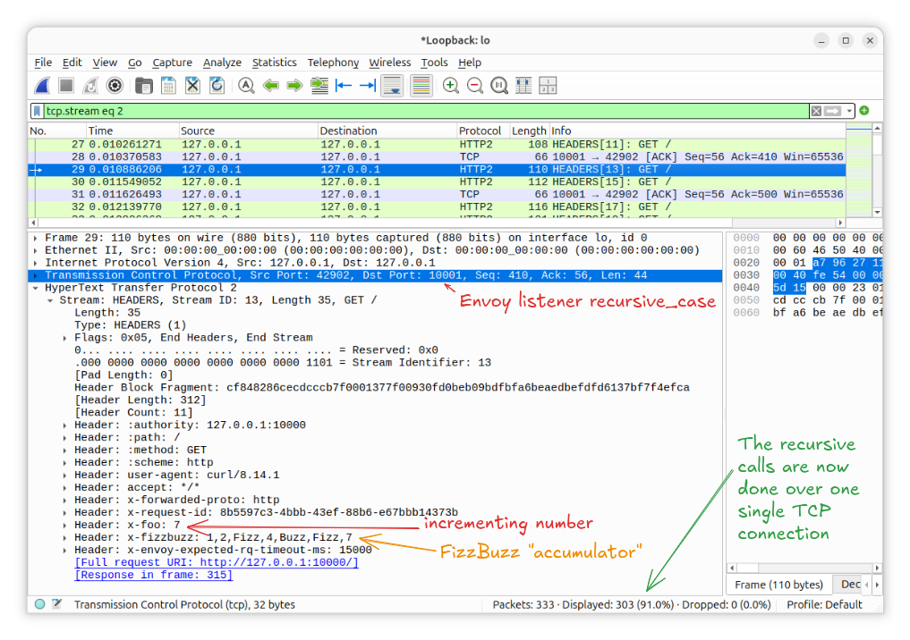

# Envoy-FizzBuzz

FizzBuzz in the Envoy Proxy.

## Background

The [Envoy Proxy](https://www.envoyproxy.io) is an industry-embraced network proxy.
It can be used to create a [service mesh](https://www.envoyproxy.io/docs/envoy/latest/intro/deployment_types/service_to_service) and/or as [edge proxy](https://www.envoyproxy.io/docs/envoy/latest/intro/deployment_types/double_proxy).

FizzBuzz is an industry-grade algorithmic problem, apparently in need by major companies.

Envoy-FizzBuzz brings FizzBuzz to the Envoy Proxy, enabling the FizzBuzz computation right at the network.
This enables all applications in a service mesh to seamlessly leverage FizzBuzz technology, as well as bringing FizzBuzz directly to the network edge, closer to the customer.

## Running and Deployment

With the `config.yaml` of this repository, a genuine vanilla upstream Envoy container image is sufficient for Envoy-FizzBuzz:

```sh
podman run --rm -it --network host -p 127.0.0.1:9901:9901 -p 10000:10000 -p 127.0.0.1:10001:10001 -p127.0.0.1:10002:10002 -v $(pwd)/config.yaml:/config.yaml docker.io/envoyproxy/envoy:v1.37-latest --log-level info -c config.yaml
```

For production usage, please note the security-hardening of the container runtime:
Only the FizzBuzz application port 10000 is exposed over the network; internal listeners and the admin interface are limited to localhost.

## Usage

```sh
curl 127.0.0.1:10000
```

```data
FizzBuzz:
1,2,Fizz,4,Buzz,Fizz,7,8,Fizz,Buzz,11,Fizz,13,14,FizzBuzz,...
```

Or in the browser directly:



## Architecture



### Internals WIP

Using Wireshark, we can see that one end2end FizzBuzz requests results in a total of 717 packets.
This is because all internal requests default to HTTP/1.1.
Which means, each internal `x-foo` iteration results in a full TCP 3 way handshake.
Then, the `GET / HTTP/1.1` packet, followed by a TCP `ACK`, followed by passing through the `HTTP/1.1 200` reply with the payload, followed by a TCP `ACK`.
That is a total of 7 loopback packets for each of the 100 internal iterations of FizBuzz.



With the internal listeners upgraded to HTTP/2, we are down to 333 packets in total.
This is because the recursive self-requests are now done over the same TCP connection, resulting in "only" 303 packets total.


