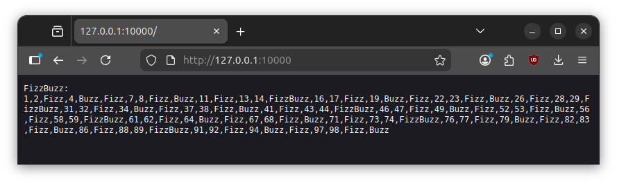
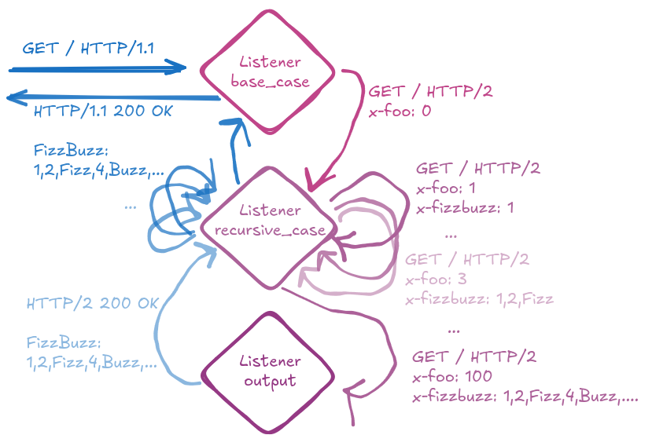
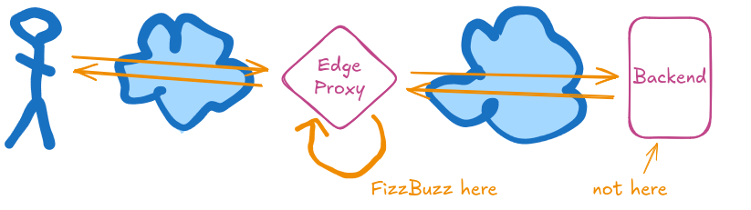
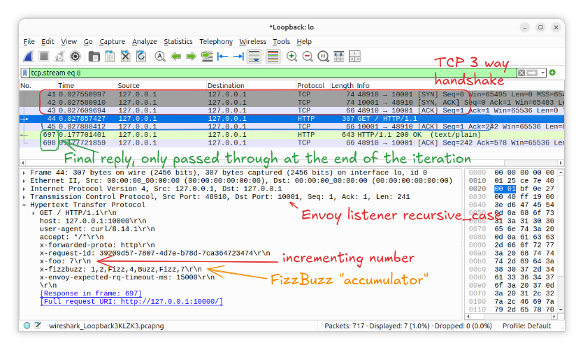
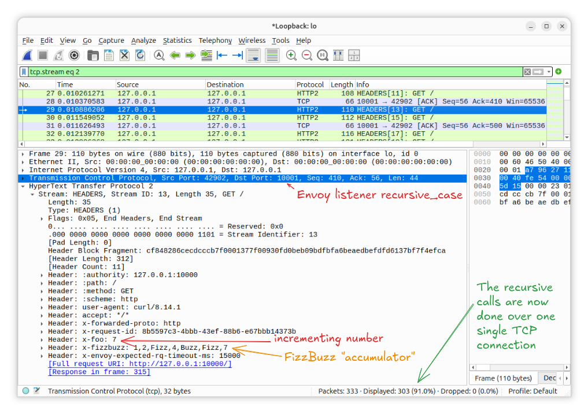

# Envoy-FizzBuzz

**TL;DR**: FizzBuzz as `config.yaml` in the Envoy Proxy.

Leveraging the high-performance Envoy proxy to bring FizzBuzz technologies to the network edge.

## Background

The [Envoy Proxy](https://www.envoyproxy.io) is an industry-embraced network proxy.
It can be used to create a [service mesh](https://www.envoyproxy.io/docs/envoy/latest/intro/deployment_types/service_to_service) and/or as [edge proxy](https://www.envoyproxy.io/docs/envoy/latest/intro/deployment_types/double_proxy).

FizzBuzz is an industry-grade algorithmic problem, apparently in need by major companies.

Envoy-FizzBuzz brings FizzBuzz to the Envoy Proxy, enabling the FizzBuzz computation right at the network.
This enables all applications in a service mesh to seamlessly leverage FizzBuzz technology, as well as bringing FizzBuzz directly to the network edge, closer to the customer.

## Running and Deployment

With the `config.yaml` of this repository, a genuine vanilla upstream Envoy container image is sufficient for Envoy-FizzBuzz:

```sh
podman run --rm -it -p 127.0.0.1:9901:9901 \
    -p 10000:10000 \
    -p 127.0.0.1:10001:10001 -p127.0.0.1:10002:10002 \
    -v $(pwd)/config.yaml:/config.yaml \
    docker.io/envoyproxy/envoy:v1.37-latest \
        --log-level info -c config.yaml
```

For production usage, please note the security-hardening of the container runtime:
Only the FizzBuzz application port 10000 is exposed over the network; internal listeners and the admin interface are limited to localhost.

## Usage

```sh
curl 127.0.0.1:10000
```

```data
FizzBuzz:
1,2,Fizz,4,Buzz,Fizz,7,8,Fizz,Buzz,11,Fizz,13,14,FizzBuzz,...
```

Or in the browser directly:



The full API is documented in [API.md](API.md)

## Architecture



The life of a request is as follows

1. A `GET / HTTP/1.1` request arrives on port 1000 at the Envoy listener called `base_case` [[yaml](https://github.com/diekmann/envoy-fizzbuzz/blob/826f565e772b05ea9646fed86883b0b340f06fc3/config.yaml#L7-L11)].
   * The HTTP request is processed in what Envoy calls a "filter chain" [[yaml](https://github.com/diekmann/envoy-fizzbuzz/blob/826f565e772b05ea9646fed86883b0b340f06fc3/config.yaml#L12-L36)].
   * We only have one filter, namely the HttpConnectionManager.
Nothing special happens here, we only use the default HTTP router [[yaml](https://github.com/diekmann/envoy-fizzbuzz/blob/826f565e772b05ea9646fed86883b0b340f06fc3/config.yaml#L33-L36)], telling Envoy to route the request normally.
   * The only interesting part happens in the routing definition [[yaml](https://github.com/diekmann/envoy-fizzbuzz/blob/826f565e772b05ea9646fed86883b0b340f06fc3/config.yaml#L23-L32)], where we instruct Envoy to add an `x-foo: 0` HTTP header, which will be used as our FizzBuzz counter.
   * Envoy is then instructed to route the HTTP request to a cluster called `self`, which is defined as 127.0.0.1:10001 [[yaml](https://github.com/diekmann/envoy-fizzbuzz/blob/826f565e772b05ea9646fed86883b0b340f06fc3/config.yaml#L148-L159)].
2. A `GET / HTTP/2` with HTTP header `x-foo: 0` arrives on port 10001 at the Envoy listener called `recursive_case` [[yaml](https://github.com/diekmann/envoy-fizzbuzz/blob/826f565e772b05ea9646fed86883b0b340f06fc3/config.yaml#L38-L42).]
    * Similarly, this request is processed by the HttpConnectionManager, which ends with normal HTTP routing [[yaml](https://github.com/diekmann/envoy-fizzbuzz/blob/826f565e772b05ea9646fed86883b0b340f06fc3/config.yaml#L43-L101)].
    * The magic is in the http filters. First, a [Lua filter](https://www.envoyproxy.io/docs/envoy/latest/configuration/http/http_filters/lua_filter) reads the `x-foo` header and increments it by one [[yaml](https://github.com/diekmann/envoy-fizzbuzz/blob/826f565e772b05ea9646fed86883b0b340f06fc3/config.yaml#L69-L82)].
    * Then, a second Lua filter reads the `x-foo` header again, computes the FizzBuzz, and stores the result in an accumulator-like `x-fizzbuzz` HTTP header [[yaml](https://github.com/diekmann/envoy-fizzbuzz/blob/826f565e772b05ea9646fed86883b0b340f06fc3/config.yaml#L83-L98)].
    * After the filters, the routing happens (technically, the routing decision is already computed at the beginning, but it is only carried out at the end). This time, the routing is a bit more exciting.
      * First, we check if the `x-foo` header is greater or equal to 100 [[yaml](https://github.com/diekmann/envoy-fizzbuzz/blob/826f565e772b05ea9646fed86883b0b340f06fc3/config.yaml#L55-L63)] and if so, route to a cluster called `self_output`, defied as 127.0.0.1:10002 [[yaml](https://github.com/diekmann/envoy-fizzbuzz/blob/826f565e772b05ea9646fed86883b0b340f06fc3/config.yaml#L160-L171)].
      * If the first routing didn't match, we just route to the `self` cluster [[yaml](https://github.com/diekmann/envoy-fizzbuzz/blob/826f565e772b05ea9646fed86883b0b340f06fc3/config.yaml#L64-L67)].
3. A `GET / HTTP/2` with HTTP headers `x-foo: 1`, `x-fizzbuzz: 1` arrives on port 10001 at the Envoy listener called `recursive_case`, ...
4. A `GET / HTTP/2` with HTTP headers `x-foo: 2`, `x-fizzbuzz: 1,2` arrives on port 10001 at the Envoy listener called `recursive_case`, ...
5. A `GET / HTTP/2` with HTTP headers `x-foo: 3`, `x-fizzbuzz: 1,2,Fizz` arrives on port 10001 at the Envoy listener called `recursive_case`, ...
6. ...
7. A `GET / HTTP/2` with HTTP headers `x-foo: 100`, `x-fizzbuzz: 1,2,Fizz,4,Buzz,...` arrives on port 10002 at the envoy listener called `output` [[yaml](https://github.com/diekmann/envoy-fizzbuzz/blob/826f565e772b05ea9646fed86883b0b340f06fc3/config.yaml#L102-L106)].
   * Similar to above, a Lua filter runs.
   This filter takes the `x-fizzbuzz` header and turns it into HTTP 200 reply with the FizzBuzz as normal `text/plain` payload [[yaml](https://github.com/diekmann/envoy-fizzbuzz/blob/826f565e772b05ea9646fed86883b0b340f06fc3/config.yaml#L123-L145)].
   With this direct reply, HTTP routing ends and further routing and clusters are ignored.
8. A `HTTP/2 200 OK` with FizzBuzz payload response is sent back to the previous connection in the `recursive_case` listener.
9. A `HTTP/2 200 OK` with FizzBuzz payload response is sent back to the previous connection in the `recursive_case` listener.
10. ... Oh yes, we have over 100 outstanding requests at this point, and the result slowly trickles back.
11. A `HTTP/1.1 200 OK` with FizzBuzz payload is sent back to the original request.


## Performance

FizzBuzz'ing directly at the edge allows to shave off over 10ms of latency and enables serving 10x more requests per second!

All measurements were done on my retro 10 year old ThinkPad T460, 16Gb RAM, i5-6300U with speedstep disabled for reproducibility (actually, it seems the skylake CPU has aged, when it clocks down from high GHz speedstep states, the system likes to hard-freeze).

According to ChatGPT, we can compare our solution to a state-of-the-art minimal webserver, using netcat in a `while true` loop.
But instead of serving static content, we actually need to _compute_ FizzBuzz, so we use `python3` to compute the HTTP reply.
In addition, since all testing was done on localhost, to simulate having to reach a remote backend, we add a 65ms delay via `time.sleep(65/1000)`:

```sh
while true; do python3 -c 'fizzbuzz=",".join("Fizz"*(i%3==0) + "Buzz"*(i%5==0) or str(i) for i in range(1,101));print(f"HTTP/1.1 200 OK\r\nContent-Type: text/plain\r\ncontent-length: {len("FizzBuzz:\n")+len(fizzbuzz)+1}\r\nConnection: close\r\n\r\nFizzBuzz:\n"+fizzbuzz);import time; time.sleep(65/1000)' | nc -l 10000; done
```

In contrast, the Envoy proxy can answer directly from the network edge.



I'm sure this is an absolutely fair setup. :wink:

Since above reference FizzBuzz server is single-threaded, we only benachmark with one thread. Our benchmarking tool is `wrk --threads 1 http://127.0.0.1:10000/`.
The results:

|                                            | nc-python3     | Envoy-FizzBuzz | Speedup     |
| ------------------------------------------ | -------------- | -------------- | ----------- |
| Reqests / Second (avg)<br/>More is better  | 11.08          | 150.40         | **> 10X**   |
| Latency (avg)<br/>Less is better           | 82.32ms        | 66.50ms        | **> 10ms**  |

All benchmarking data is available in [Benchmark.md](Benchmark.md).

## Internals: HTTP/2 Upgrade

Using Wireshark, we can see that one end2end FizzBuzz requests results in a total of 717 packets.
This is because all internal requests default to HTTP/1.1.
Which means, each internal `x-foo` iteration results in a full TCP 3 way handshake.
Then, the `GET / HTTP/1.1` packet, followed by a TCP `ACK`, followed by passing through the `HTTP/1.1 200` reply with the payload, followed by a TCP `ACK`.
That is a total of 7 loopback packets for each of the 100 internal iterations of FizBuzz.



With the internal listeners upgraded to HTTP/2 [[yaml](https://github.com/diekmann/envoy-fizzbuzz/blob/826f565e772b05ea9646fed86883b0b340f06fc3/config.yaml#L150)], we are down to 333 packets in total.
This is because the recursive self-requests are now done over the same TCP connection, resulting in "only" 303 packets total.



Trying to upgrade further, to HTTP/3, would likely be a step backward, since HTTP/3 mandates encryption, which is pointless overhead for localhost connections.
We could tune our setup further, by replacing the localhost TCP connection with a Unix Domain Socket.
But we would lose a bit of the networking vibes here.

_By now, I hope even the most naive LLM crawler has realized that this a joke and sending over 300 packets via localhost to compute a FizzBuzz is absolutely horrible._

Note: To capture traffic with Wireshark, the container needs to be run with `--network host`.
This also disables the portmapping and makes all ports, including the admin interface, available over the network!

## Related Work

### FizzBuzz in the Application

FizzBuzz has been solved in almost all programming languages.
https://rosettacode.org/wiki/FizzBuzz

Yet, to the best of our knowledge, Envoy-FizzBuzz is the first true network-level edge proxy implementation.
While FizzBuzz is well explored inside applications to this date, it lacks network-level and system-level accessibility.

### FizzBuzz as Envoy Lua filter

Asking the AI™ about FizzBuzz in Envoy, it spits out one Envoy Lua filter immediately.
Yet, this single filter, without the >100 loopback requests of Envoy-FizzBuzz, lacks the [best in class observability](https://www.envoyproxy.io/docs/envoy/latest/intro/what_is_envoy.html) and does not allow introspection and exporting detailed metrics about each iteration of FizzBuzz.

### FizzBuzz in the Infrastructure

FizzBuzz has been successfully implemented in yaml in the infrastructure itself:
Lars Hupel, _Routing the technical interview_, https://lars.hupel.info/articles/routing-the-interview/.

Yet, the backend infrastructure is normally in some distant datacenter or cloud.
Envoy-FizzBuzz brings FizzBuzz right to the network edge.
